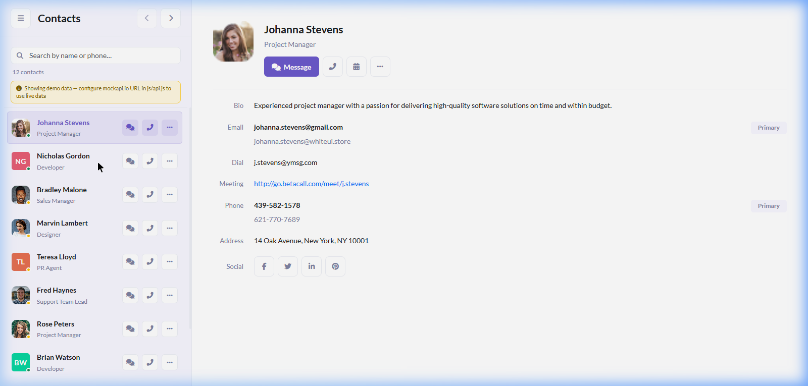
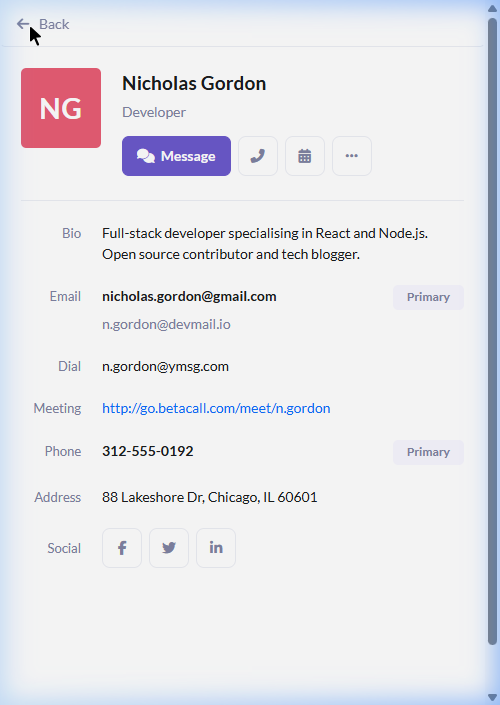

# Contact Management Dashboard

A dynamic, single-page contact management application built with **HTML**, **CSS (Bootstrap 5)**, and **Vanilla JavaScript** — structured using Angular-pattern OOP (class-based services and components).

This was built as a front-end coding exercise against a Contact Management REST API, using [mockapi.io](https://mockapi.io) as the mock backend.

---

## 🚀 Live Features

- **Contact List** — displays all contacts from the API with avatar, name, job title, and status indicator
- **Contact Details** — click any contact to see their bio, all email addresses (with Primary badge), phone numbers, address, meeting link, and social links
- **Real-time Search** — filter by name or phone number; press `Escape` to clear
- **Pagination** — navigate through contacts 10 at a time with Prev / Next
- **Initials Avatars** — colour-coded fallback when no photo is available
- **Responsive Design** — full mobile support with slide-in detail panel and Back button
- **Unit Tests** — 17 inline tests, auto-run on page load (results in DevTools Console)
- **Mock Data Fallback** — gracefully falls back to rich demo data if the API is unreachable

---

## 🗂️ Project Structure

```
front-end-test/
├── index.html          # SPA shell — dynamic, no hardcoded contacts
├── css/
│   └── style.css       # Full responsive stylesheet
├── js/
│   ├── api.js          # ContactApiService (data layer + mock data)
│   ├── app.js          # ContactListComponent, ContactDetailsComponent, ContactApp
│   └── tests.js        # In-browser unit test runner (17 tests)
└── images/             # Avatar thumbnails
```

### Architecture

The code is structured to mirror an Angular application:

| JS Class | Angular Equivalent |
|----------|-------------------|
| `ContactApiService` | `@Injectable()` service with `HttpClient` |
| `ContactListComponent` | `@Component({ selector: 'app-contact-list' })` |
| `ContactDetailsComponent` | `@Component({ selector: 'app-contact-details' })` |
| `ContactApp.init()` | `platformBrowserDynamic().bootstrapModule()` |

---

## ⚙️ Running the App

### Option 1 — Open directly in a browser (simplest)

1. Clone or download the repository
2. Double-click `index.html` to open it in your browser

> **Note:** Some browsers block `fetch()` on `file://` URLs due to CORS restrictions. If contacts don't load, use Option 2.

### Option 2 — Local HTTP server (recommended)

**Using Node.js (no install needed):**
```bash
node -e "const http=require('http'),fs=require('fs'),path=require('path');const mime={'html':'text/html','css':'text/css','js':'application/javascript','png':'image/png'};http.createServer((req,res)=>{let f=path.join(__dirname,req.url==='/'?'index.html':req.url);try{res.writeHead(200,{'Content-Type':mime[path.extname(f).slice(1)]||'text/plain'});res.end(fs.readFileSync(f));}catch{res.writeHead(404);res.end();}}).listen(8765,()=>console.log('Open http://localhost:8765'));"
```
Then visit **http://localhost:8765**

**Using VS Code Live Server:**
1. Install the [Live Server extension](https://marketplace.visualstudio.com/items?itemName=ritwickdey.LiveServer)
2. Right-click `index.html` → **Open with Live Server**

**Using Python:**
```bash
# Python 3
python -m http.server 8765
# Then open http://localhost:8765
```

---

## 🔌 Connecting a Real mockapi.io Backend

1. Go to [mockapi.io](https://mockapi.io) and create a free project
2. Add a `contacts` resource with these fields:

   | Field | Type |
   |-------|------|
   | `firstName` | string |
   | `lastName` | string |
   | `avatar` | string (URL) |
   | `jobTitle` | string |
   | `bio` | string |
   | `phone` | string |
   | `address` | string |
   | `status` | string (`online` / `away`) |

3. Add a nested `email_addresses` resource under `contacts`:

   | Field | Type |
   |-------|------|
   | `email` | string |
   | `isPrimary` | boolean |

4. Open `js/api.js` and update the URL at the top:

```js
const API_BASE_URL = 'https://YOUR_PROJECT_ID.mockapi.io/api/v1';
```

The app will now fetch live data. If the API is unreachable, it falls back to the built-in demo dataset automatically.

---

## 🧪 Unit Tests

Tests run automatically when the page loads. Open **DevTools → Console** to see results:

```
🧪 Contact Management – Unit Tests
  📋 getInitials()                    — 4 tests ✅
  📋 escHtml()                        — 5 tests ✅
  📋 ContactListComponent.filter()    — 8 tests ✅
🎉 Tests: 17/17 passed
```

Tests cover:
- `getInitials()` — name parsing and edge cases
- `escHtml()` — XSS prevention
- `ContactListComponent.filter()` — search/filter logic

> E2E tests are excluded per the exercise specification.

---

## 💡 Design Decisions & Assumptions

All assumptions and simplifications are documented as comments directly in the source files. Key ones:

- **Angular/TypeScript → Vanilla JS:** The spec requires Angular, but the user confirmed implementation directly in the existing `index.html`. The code uses Angular design patterns (DI, component classes, service layer) without a build step.
- **Routing:** Simulated via panel visibility / slide transitions. A full implementation would use Angular Router for `/contacts` and `/contacts/:id`.
- **Error handling:** Falls back to mock data with a console warning. A production app would add retry logic, toast notifications, and error boundary components.
- **Cross-device testing:** Verified on desktop and 375px mobile viewport. Full cross-device QA would require physical device testing.
- **State management:** Component-local state only. A production app would use NgRx or Angular Signals for a shared contacts store.

---

## 📸 Screenshots

### Desktop View


### Mobile View (375px)


---

## 🛠️ Tech Stack

- **HTML5** — semantic, accessible markup
- **CSS3 / Bootstrap 5** — responsive grid and utility classes
- **Vanilla JavaScript (ES6+)** — class-based OOP, async/await
- **Font Awesome 6** — icons
- **Google Fonts (Lato)** — typography
- **mockapi.io** — mock REST API backend

---

## 📁 No Build Step Required

This project has **no dependencies to install** and **no build process**. Just open `index.html` in a browser.
